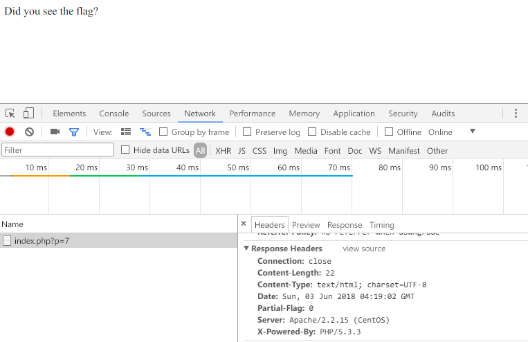

# AIS3 pre-exam 2018: warmup

**Category:** WEB  
**Points:** 1  

## Write-up

起始頁面如下：  



這題的解題人數僅次於簽到，所以我想大家都有成功解出這一題。  
雖然我是到了比賽 AIS3 賽程第二天才發現這細微的變化，就如同 misc2 一樣，略過一些細微觀察，原因在於錯把頁面 `GET p=7` 誤看成是 SQL Injection 的題目類型，透過更動數字沒有發現頁面上有變動，甚至沒有意識到 Headers 中藏有 `Partial-Flag`...。

**Dump Partial-Flag**

這時候撰寫了一個小腳本，嘗試抓取 `p=[x]` 頁面中的 Headers。

```Python
#!/usr/bin/python3
import os

url = 'http://104.199.235.135:31331/index.php?p='
for i in range(50):
    os.system('curl -v ' + url + str(i))
    print(url + str(i))
```

由於不知道怎麼透過 `curl` 來過濾 Headers，之後也沒有使用 `Regular` 等...方式來過濾撈到的資料，使用百年傳統技術...，將撈到的資料一一取出 Partial-Flag 的值。

```
< Partial-Flag: A
http://104.199.235.135:31331/index.php?p=0
< Partial-Flag: I
http://104.199.235.135:31331/index.php?p=1
< Partial-Flag: S
http://104.199.235.135:31331/index.php?p=2
< Partial-Flag: 3
http://104.199.235.135:31331/index.php?p=3
< Partial-Flag: {
http://104.199.235.135:31331/index.php?p=4


...

< Partial-Flag: f
http://104.199.235.135:31331/index.php?p=37
< Partial-Flag: i
http://104.199.235.135:31331/index.php?p=38
< Partial-Flag: e
http://104.199.235.135:31331/index.php?p=39
< Partial-Flag: 1
http://104.199.235.135:31331/index.php?p=40
< Partial-Flag: d
http://104.199.235.135:31331/index.php?p=41
< Partial-Flag: s
http://104.199.235.135:31331/index.php?p=42
< Partial-Flag: .
http://104.199.235.135:31331/index.php?p=43
< Partial-Flag: }
http://104.199.235.135:31331/index.php?p=44
```

**GetFlag:**

`AIS3{g00d! u know how 2 check H3AD3R fie1ds.}`