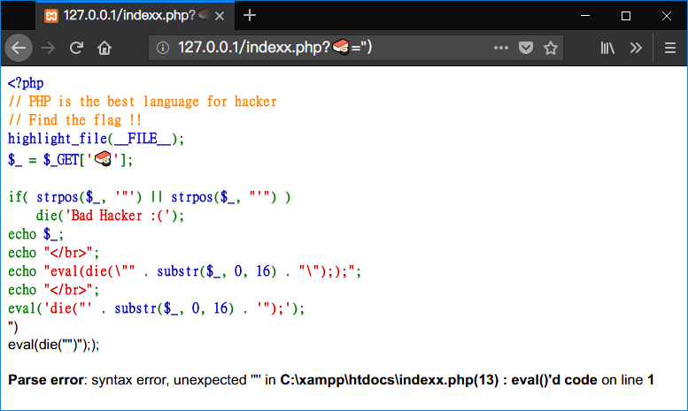
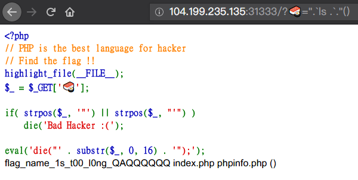
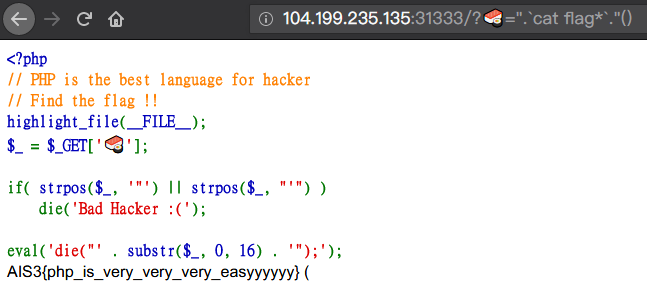

# AIS3 pre-exam 2018: sushi

**Category:** WEB  
**Points:** 3  

## Write-up

**source code：**
```php
<?php
// PHP is the best language for hacker
// Find the flag !!
highlight_file(__FILE__);
$_ = $_GET['🍣'];

if( strpos($_, '"') || strpos($_, "'") ) 
    die('Bad Hacker :(');

eval('die("' . substr($_, 0, 16) . '");');
```

### Analysis:

首先透過觀察可以發現有 `eval` 可以利用，但先前條件是須將 `strpos()` 及 `die()` bypass 掉。

**strpos()**

[`strpos ( string $haystack , mixed $needle [, int $offset = 0 ] )`](http://php.net/manual/en/function.strpos.php) 函式，如果字串中有找到特定字串，則返回第幾位。

假設 `data = ABCDEFG` 並且透過 `strpos(data, 'C')` 則會返回 2 (從0開始計算) 。[1]

**die()**

`die()` 函數會使頁面腳本停止，有點類似迴圈中的 `break`，但 `die` 停止的是整個頁面的程式，並輸出函數中的字串或函數。

**substr**

`substr($_, 0, 16)` 接收的 GET 資料字串長度只能有 16 位數。

**Testing**

首先在程式碼 Copy 一份下來，並隨手架個 Web Server (Apache)，接著加上以下程式碼於 `eval('die("' . substr($_, 0, 16) . '");');` 之前，就可在本機端來觀察填字遊戲的狀態，並且記得開啟 `DEBUG` 選項，讓錯誤訊息出現以提供參考。
```PHP
echo $_;
echo "</br>";
echo "eval(die(\"" . substr($_, 0, 16) . "\"););";
echo "</br>";
```


### Exploit

1. 藉此透過 [1] 的方式，可以將 `"` 放置在第一位繞過 `strpos($_, '"')`， 並且接著 `"` 來閉合製造空字串 `die(""`。
2. 閉合 `die(""` 成空字串之後，可以注入其他函數來進行系統操作，或是取得系統 Shell，在 PHP 下可以透過 `.` 來接合字串，於是加上送出 GET 參數 `` ".`ls .` . "() ``。



其中 `ls .` 是 Unix 的指令，檢視當前的目錄，並發現目錄下有 `flag_name_1s_t00_l0ng_QAQQQQQQ`、`index.php`、`phpinfo.php()`，三個檔案。

3. 由於有 `substr($_, 0, 16)` 的長度限制，要瀏覽 `flag_name_1s_t00_l0ng_QAQQQQQQ` 不用算就知道超過限制長度，於是用 `*` 來取代任意長度的字元，送出 GET ``.`cat flag*`."()``，取得好吃的 ~~Sushi~~ (Flag)。




**GetFlag:**

`AIS3{php_is_very_very_very_easyyyyyy}`

### 額外補充

Payload 的部分 ``.`cat flag*`."()`` 後面的 `."()` 中的 `()` 是沒有意義的，不加上也是可以動的。