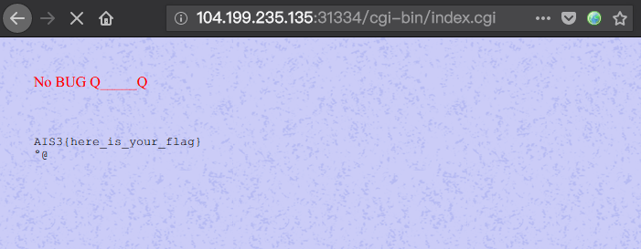

# AIS3 pre-exam 2018: perljam

**Category:** WEB  
**Points:** 4  

## Write-up

1. 首先在 `104.199.235.135_31334/.git` 發現有 `git` 沒有清除，透過 [gitHack](https://github.com/lijiejie/GitHack) 來還原原始碼。

**index-b44be173b965d6bdc0b784b6797fac0a.cgi.bak:**
```perl
#!/usr/bin/perl
# My uploader!
use strict;
use warnings;
use CGI;
my $cgi = CGI->new;
print $cgi->header();
print "<body style=\"background: #caccf7 url('https://i.imgur.com/Syv2IVk.png');padding: 30px;\">";
print "<p style='color:red'>No BUG Q_____Q</p>";
print "<br>";
print "<pre>";
if( $cgi->upload('file') ) {
        my $file = $cgi->param('file');
        while(<$file>) {
                print "$_";
        }
}
```

2. 檢視一下原始碼過後，並利用 Google 搜尋這類型的漏洞，此外發現已經有其他 CTF 出過了，直接參考下列 Write-up 及文件。

* [2016-ctf.csaw.io/web-200-i_got_id.md](https://github.com/73696e65/ctf-notes/blob/master/2016-ctf.csaw.io/web-200-i_got_id.md)


* [Blackhat ASIA 2016 talk](https://www.blackhat.com/docs/asia-16/materials/asia-16-Rubin-The-Perl-Jam-2-The-Camel-Strikes-Back.pdf)

透過 Burp Suite 改變 POST 內容。


得到：


這邊沒有仔細查看所有檔案及目錄，只看到以下這行。  
`-rw-------   1 root root   24 May 30 04:46 flag`  
在 `flag` 目錄底下，有一個 `flag` 檔案，但權限限制 root 存取，一開始以為還要想辦法提權，或是假 Flag 之類的，甚至 Payload 改用 `?/bin/bash%20-c%20find${IFS}/${IFS}-name${IFS}'flag'`，查看有沒有其他 Flag，還發現有其他人在 /tmp/ 下自己建了 flag，會發現是因為看到建立日期為 6/2 XDDD

3. 發現 `readflag`  

發現執行檔 `readflag` 就執行看看吧。


Flag 就跑出來了。



**GetFlag:**

`AIS3{here_is_your_flag}`