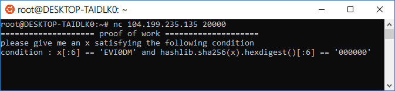
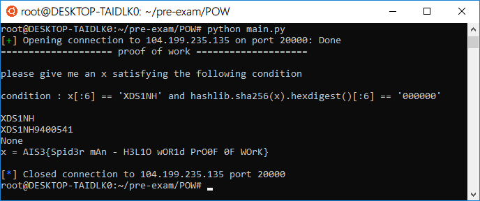

# AIS3 pre-exam 2018: POW

**Category:** Crypto  
**Points:** 1  

## Write-up

透過連線的 nc 連線至題目伺服器，接著要求輸入滿足題目要求的字串。  
伺服器端提醒使用者輸入滿足 `x[:6] == 'XXXXXX'` 且 `hashlib.sha256(x).hexdigest()[:6] == '000000'` 這題目的要求就如同礦工的行為，難怪名稱會叫 POW。



**原理:**
> [https://en.bitcoin.it/wiki/Proof_of_work](https://en.bitcoin.it/wiki/Proof_of_work) 
```
"Hello, world!0" => 1312af178c253f84028d480a6adc1e25e81caa44c749ec81976192e2ec934c64
"Hello, world!1" => e9afc424b79e4f6ab42d99c81156d3a17228d6e1eef4139be78e948a9332a7d8
"Hello, world!2" => ae37343a357a8297591625e7134cbea22f5928be8ca2a32aa475cf05fd4266b7
...
"Hello, world!4248" => 6e110d98b388e77e9c6f042ac6b497cec46660deef75a55ebc7cfdf65cc0b965
"Hello, world!4249" => c004190b822f1669cac8dc37e761cb73652e7832fb814565702245cf26ebb9e6
"Hello, world!4250" => 0000c3af42fc31103f1fdc0151fa747ff87349a4714df7cc52ea464e12dcd4e9
```
得到題目要求 x 方法與此相同，所以寫了一隻 `findX.py` 來找 x。

``` Python
#!/usr/bin/python3
from pwn import *
import math
ip   = '104.199.235.135'
prot = 20000

r = remote(ip, prot)

print(r.recvline())
print(r.recvline())
data = r.recvline()
print(data)
data = data.split(' ')[4]
data = data.strip('\'')
anwser = ''
for i in range(100000000):
    if hashlib.sha256((data + str(i)).encode('utf-8')).hexdigest()[:6] == '000000':
        anwser = (data + str(i))
        break
print(anwser)
print(r.sendline(anwser))
print(r.recvline())
```

