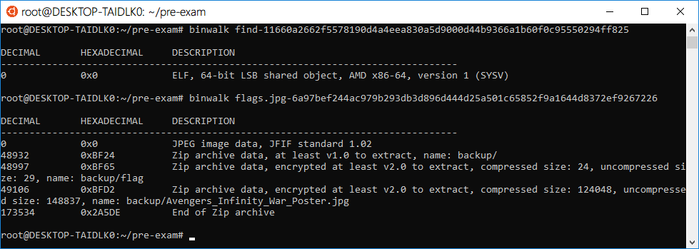
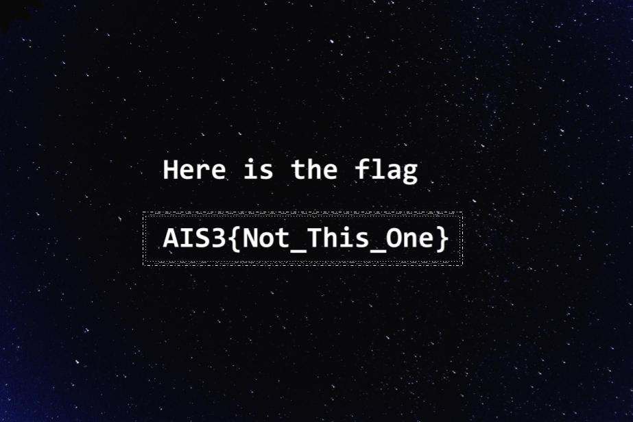
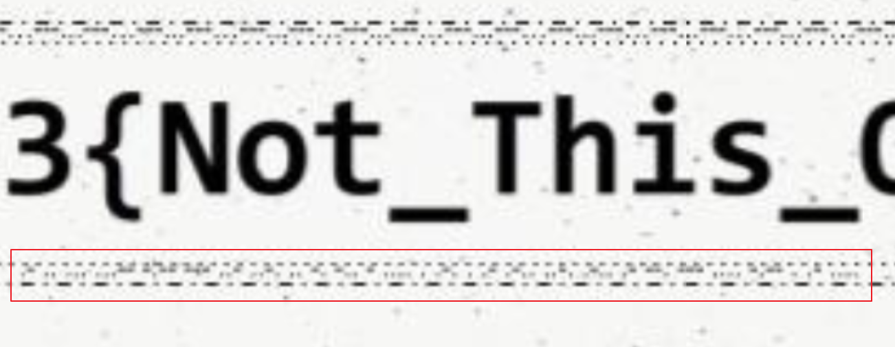

# AIS3 pre-exam 2018: flags

**Category:** MISC  
**Points:** 2  

## Write-up

提供了 [flags.jpg](./flags.jpg-6a97bef244ac979b293db3d896d444d25a501c65852f9a1644d8372ef9267226) 一張圖片。  

### Fake FLAG

當下看到題目很直覺的就丟了 Binwalk



果真發現裡面藏有壓縮檔，也順利把它分離出來，卻是一個上鎖的 zip 檔案。  
壓縮檔內含有一張圖片及一個flag檔案。  
透過強大的 Google 搜尋找到與壓縮檔內 CRC 相符的圖片。  
並且成功使用工具 `PkCrack` 來達成已知明文攻擊解出內文得到 flag(X)

當圖片找半天好不容易看到 CRC 相符的圖片，並且從 zip 解出密碼時，不知道是多大的喜悅，每想到都是誤會一場。  
將錯誤的 Flag 提交上去出現紅底黑字的時候，只有錯愕，懷疑主辦單位放錯 Flag 了，看了聊天室才知道本題藏了三個假 Flag (不過這題我只找到兩個假Flag，不知道傳說中的第三個在哪)。

### Really FLAG

接著一段腦筋空白的時間過去了，完全沒線索的時候，重新檢視了一下 [flags.jpg](./flags.jpg-6a97bef244ac979b293db3d896d444d25a501c65852f9a1644d8372ef9267226) 這張圖片，同時使用 `Stegsolve` 等工具都沒有什麼發現。



接著也懷疑過 `AIS3{Not_This_One}` 的邊框是否藏有摩斯密碼，但看起來就整整齊齊有規則似的，直到使用 `Stegsolve` XOR 反白畫面再次仔細看...



```
.- .. ... ...-- -.-- --- ..- ..-. .. -. -.. - .... . .-. . .- .-.. ..-. .-.. .- --. --- .... -.-- . .- ....  
A  I  S   3     Y    O   U   F    I  N  D   T H    E R   E A  L    F    L    A  G   O   H    Y    E A  H
```

**FLAG**

`AIS3{YOU FIND THE REAL FLAG OH YEAH}`
