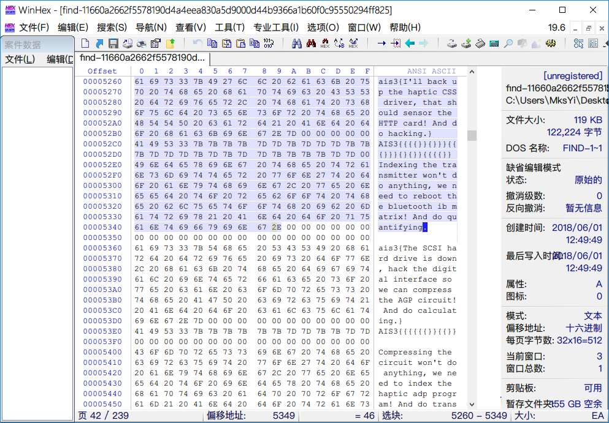
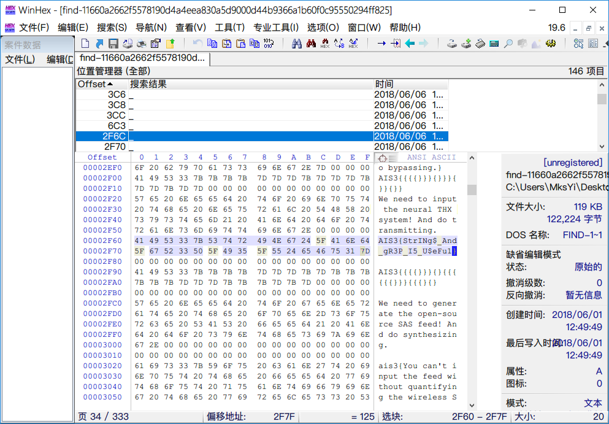

# AIS3 pre-exam 2018: find

**Category:** Reverse  
**Points:** 1  

## Write-up

提供檔案 [find](find-11660a2662f5578190d4a4eea830a5d9000d44b9366a1b60f0c95550294ff825)  

下載檔案後直接透過 WinHex 打開發現有許多雜亂的 Flag。

心想遇到這種題目完蛋了，是不是要考 `Regular` ....

看著上面的字串仔細想了一下 Flag 的格式~

**實際的Flag格式**

`AIS3{oh_my_Flag}`

**文件中大部分的Flag格式**

`AIS3{You can't input the feed without quantifying the wireless SDD matrix! And do compressing.}`

差異在於空白是用底線，藉由這一點在 WinHex 下，`Ctrl + f` 搜尋所有 `_`。

**GetFlag:**

`AIS3{StrINg$_And_gR3P_I5_U$eFu1}`