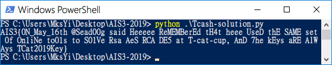

# AIS3 pre-exam 2019: TCash

**Category:** Crypto  
**Description:**  

>T? Cat? Hash?

## Write-up

該題的程式語言是 Python，主要是把密文同時編碼成 `md5`、`sha256` 兩個版本，要你嘗試解回原始字串。  

這題其實我很晚才解，因為對於 Crypto 需要數學邏輯觀念強勁的想法揮之不散，直到解其他題目解到懷疑人生時，看到了該題不少人解出，就瞄了一下。  

而且竟然幾分鐘就解出來了 OTZ!!  

這題的邏輯是，假設字串 `A` 進行編碼如下。

1. md5： 經過 `int(md5(f.encode()).hexdigest(),16)%64` 算完之後，會得到 `41`。
2. sha256： 經過 `int(sha256(f.encode()).hexdigest(),16)%64` 算完之後，會得到 `61`。

有此可知當 `md5` 的值為 `41`，且 `sha256` 的值是 `61` 時，原始字元為 `A`。

有了這個概念之後，先建立一個字串表 `abcdefghijklmnopqrstuvwxyzABCDEFGHIJKLMNOPWRSTUVWXYZ1234567890@,- _{}`，並且逐一編碼成 md5、sha256 的查詢字典。

```python
cand = 'abcdefghijklmnopqrstuvwxyzABCDEFGHIJKLMNOPWRSTUVWXYZ1234567890@,- _{}'
md5_data = []
sha256_data = []
for x in cand:
	md5_data.append(int(md5(x.encode()).hexdigest(),16)%64)
	sha256_data.append(int(sha256(x.encode()).hexdigest(),16)%64)
```

接著再去自動化比對即可得到原始字串。

```python
key = ""
for i, keyword in enumerate(md5_key):
	for j, x in enumerate(md5_data):
		if md5_key[i] == md5_data[j] and sha256s_key[i] == sha256_data[j]:
			key += cand[j]
			break;
print(key)
```

然後 Flag 竟然是彩蛋wwwww。

```
AIS3{0N_May_16th @Sead00g said Heeeee ReMEMBerEd tH4t heee UseD thE SAME set 0f On1iNe to01s to S01Ve Rsa AeS RCA DE5 at T-cat-cup, AnD 7he kEys aRE AlWAys TCat2019Key}
```


