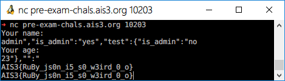

# AIS3 pre-exam 2019: Are you admin?

**Category:** Misc  
**Description:**  

>nc pre-exam-chals.ais3.org 10203

## Write-up

該題的程式語言是 ruby，主要該隻程式有兩個輸入 `name`、`age`，並且會放到 string 裡，之後解析成 JSON。

```ruby
string = "{\"name\":\"#{name}\",\"is_admin\":\"no\", \"age\":\"#{age}\"}"
res = JSON.parse(string)

if res['is_admin'] == "yes"
    puts "AIS3{xxxxxxxxxxxx}"  # flag is here
else
    puts "Hello, " + res['name']
    puts "You are not admin :("
end
```

並且該程式會判斷 JSON 中 `is_admin` 的值，是否為 `yes`，如果是的話就噴 Flag，不是的話就顯示 `You are not admin :(`。  

所以這題的解題思維就是，想辦法透過輸入，讓 `is_admin` 變成 `yes`，至於較怎麼做呢，這題我也想了許久，大概花了兩三個小時在這題上，還去複習了 JSON，最後嘗試改變「資料型態」繞過。  

具體作法是 `{"key1":"<value1>","key2":"value2","key3":"<value3>"}`，其中 `value1` 與 `value3` 為使用者輸入，但 value3 卻限制只能輸入數字 `age.match(/[[:alpha:]]/)`，但卻忽略了一點，可以輸入特殊符號。  

當 `name` 輸入為 `","is_admin":"yes","test":{"a":"b`，`age` 輸入為 `23"},"":"` 時，就會組合成以下的樣子。  

```
{"name":"","is_admin":"yes","test":{"a":"b","is_admin":"no", "age":"23","":""}
```

發現了嗎? 問題在於把名子閉合掉後，加上一個偽造的 `is_admin`，並且把原本的 `is_admin` 放到 test 的字典裡，再透過 `age` 進行閉合。  



但實際上我運行的 Payload 更臭更長一些，寫 Write-up 時，意識到這一點，解說原理的部分就做了些簡化。  