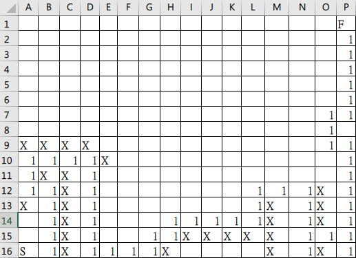

# AIS3 pre-exam 2019: Crystal Maze

**Category:** Misc  
**Description:**  

>nc pre-exam-chals.ais3.org 10202

## Write-up

ummmm..... 這題呢~  

透過手動的方式解出來，首先知道大小是 `16x16`，所以先行 nc 連上去，然後簡單指令 `up`、`down`、`left`、`right` 一輪後，得知應該是在左下角，但是有限制連線 `5` 秒後斷線，程式碼的部分就沒看了，總之就是透過 Pwntools 連上去，在短時間內幫忙跑上一個紀錄。  

照理說應該是要用路徑演算法之類的工具，但還是透過一行一行的 `sendline()` 跑到了終點，然後我還用 Excel 畫了一張地圖 ˊ_>ˋ，出題者不要揍我啊!!!

