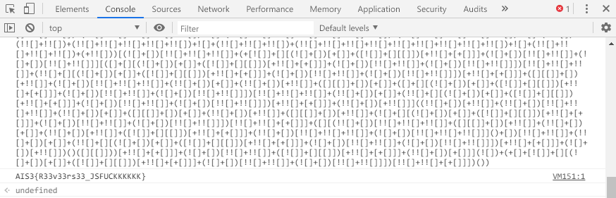

# AIS3 pre-exam 2019: KcufsJ

**Category:** Misc  
**Description:**  

>Javascript ?!

## Write-up

不得不說，題目名稱就最好的提示，但是我還是折騰了好久，首先打開就是長得像下方一團不知道是什麼東西的符號。

```
))()]]][+[+][!!+][!![)]]][!!+][!![)][+][!(+]][!!+][!![)][+][!(+]]][+[+][!!+[)]][[][+]][![(+]][+[)]
```

畢竟我也是 AIS3 第一屆的學員，當時候有一題也是 Jsfuck，所以一看就知道了，直接丟到 Browser 上執行卻跑不出個所以來。  

接著嘗試去看內容，嘗試用腦捕的方式去解題...，對我想著嘗試修復這些看不懂的 Code...。  

直到解題人數不斷攀升，才在思考...應該是很簡單的解法，不然怎麼這麼多人解，就快瀕臨崩潰時，嘗試把 Jsfuck 的 `A`、`I`、`S` 單獨轉換，然後交叉的字串比對，還是沒有收穫。

直到看著看最底部 `[+][!([][`，嘗試手動逆向組合得到 `[][(!]]+[`，髒話就直接出來了，Jsfuck 的開頭就是 `[]`，所以說就如同題目名稱，轉向後再丟到 Browser。

