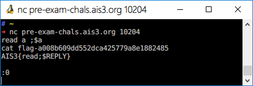

# AIS3 pre-exam 2019: Pysh

**Category:** Misc  
**Description:**  

>nc pre-exam-chals.ais3.org 10204  
>@kaibro

## Write-up

首先該題目有過濾掉一些字串，如下。

```python
black_list = "bcfghijkmnoqstuvwxz!@#|[]{}\"'&*()?01234569"
```

並且把他放到 `os.system()` 執行系統指令，問題就在於有許多字元被過濾了，常用的 `ls`、`cat` 等指令皆無法作用。  

首先嘗試將沒有被過濾的字元整理出來，有 `adelpr78$+`。  

由於 Linux 基礎缺缺，經過朋友偷偷提示，丟了「[Linux read 命令](http://www.runoob.com/linux/linux-comm-read.html)」連結給我，其餘的部分就是靠自己努力了。  

經過許多嘗試 Payload，模式大多如下。

```
read a
ls | $a

read -d ^ a
ls
$a^
```

最後嘗試出成功的 Payload 如下。

```
read a ; $a
ls

read a ; $a
cat flag
```

