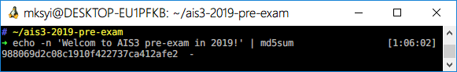

# AIS3 pre-exam 2019: Welcome

**Category:** Misc  
**Description:**  

>AIS3{echo -n 'Welcom to AIS3 pre-exam in 2019!' | md5sum}  
>Ps. md5 hash only

## Write-up

透過 Linux 內建指令就可以解題了。  

接著丟進 AIS3{} 中，得到 `AIS3{988069d2c08c1910f422737ca412afe2}`。