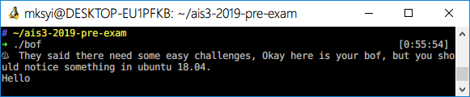
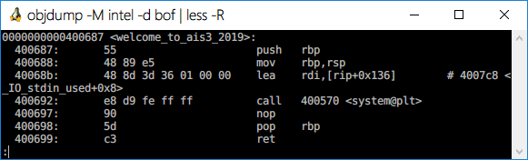

# AIS3 pre-exam 2019: Welcome BOF

**Category:** Crypto  

## Write-up

這題算是 Buffer Overflow 的最基礎的題型，關於 Buffer Overflow 可以參考以下。  

1. [從毫無基礎開始 Pwn – 概念](https://mks.tw/2968/資訊安全-從毫無基礎開始-pwn-概念)
2. [從毫無基礎開始 Pwn – Buffer Overflow](https://mks.tw/2976/資訊安全-從毫無基礎開始-pwn-buffer-overflow)

嘗試執行程式可以發現是一個基本的輸入/輸出程式，當使用者輸入後，程式隨即結束。

嘗試使用 `objdump` 後，發現程式碼中有個 `welcome_to_ais3_2019` 的 Function，然後使用了 `system` 的函數，由此可知可能是該 Function 開了個 Shell。

所以利用方法很簡單，就是製造 Buffer Overflow，並且跳到 `welcome_to_ais3_2019` Function 的位置上。

由於拿到 Flag 後沒截圖，PoC 直接參考 [Welcome_BOF-solution.py](./Welcome_BOF-solution.py)，透過 Pwntools 拿到 Shell 後，找到 Flag 的位置，並且 cat 即可。