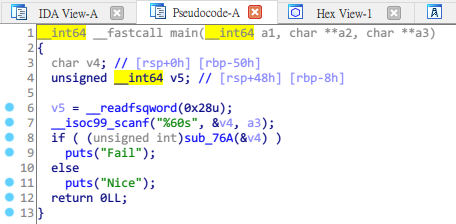

# AIS3 pre-exam 2019: Trivial

**Category:** Reverse  
**Description:**  

>It's trivial, but the speed would affect your ranking  
>PM @terrynini38514 if this challenge has any issue  

## Write-up

首先拿到該題就先嘗試性的執行，輸入個東西，得到 `Fail`，讓他 Buffer Overflow 會得到 `Nice`，感覺上兩種結果都取得了，透過 IDA Pro 看不出什麼蛛絲馬跡。  

  

最後使用 Linux 指令 `strings` 發現 Flag 的蹤跡。  

  

可是好像有蓄意經過一些處理，使好想辦法解回來，先看第一個 AIS3，第二個變成 IS3{，第三個變成 S3{T，第四個變成 3{Th，第五個變成 {Thi，這時候第一個最後面的 3 消失了，所以可以計算出他的位移量。  

```
>AIS3
IS3{
S3{T
3{Th
>{Thi
This
his_
is_i
>s_is
_is_
is_a
s_a_
>_a_r
a_re
_rea
real
>eall
alll
llll
llll
>llll
llll
llll
llll
>llll
llll
llly
lly_
>ly_b
y_bo
_boa
boar
>oari
arii
riii
iiin
>iing
ing_
ng_c
g_ch
>_cha
chal
hall
alle
>llen
leng
enge
>nge}
```

只要把箭頭的部分組合起來就是 Flag `AIS3{This_is_a_reallllllllllly_boariiing_challenge}`。