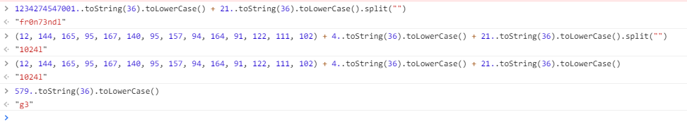
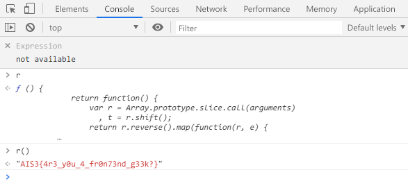

# AIS3 pre-exam 2019: Hidden

**Category:** Web  
**Description:**  

>FIND THE FLAG  
>Link: http://pre-exam-web.ais3.org:10101/

## Write-up

該題進到頁面之後，使用 F12 查看原始碼，發現頁面上載入了一個 `main.js` 的檔案，其中內容是很沉長的 Javascrip，由於忘記備份、截圖，現在有點尷尬解說。  

不得不說該題也讓我看了很久，甚至方向還被誤導，印象中有 `./flag` 這樣的寫死路徑，在想到底可以用什麼方式去把 flag 讀出來，折騰了大概一天左右。  

最後解法思路（當下的截圖）。  

簡單的說就是擷取 `main.js` 的片段程式碼，直接在 Browser 上執行，就會直接得到字串內容了，有點像是以前在練習 CTF 時解的一到題目「[[07] Javascript - Native code」](https://github.com/MksYi/Security-Exercise/tree/master/Root-Me/Web-Client/%5B07%5D%20Javascript%20-%20Native%20code)」。  

接著呢，藉由這樣的思路，把關鍵的程式碼取出來執行就可以得到 Flag。  

