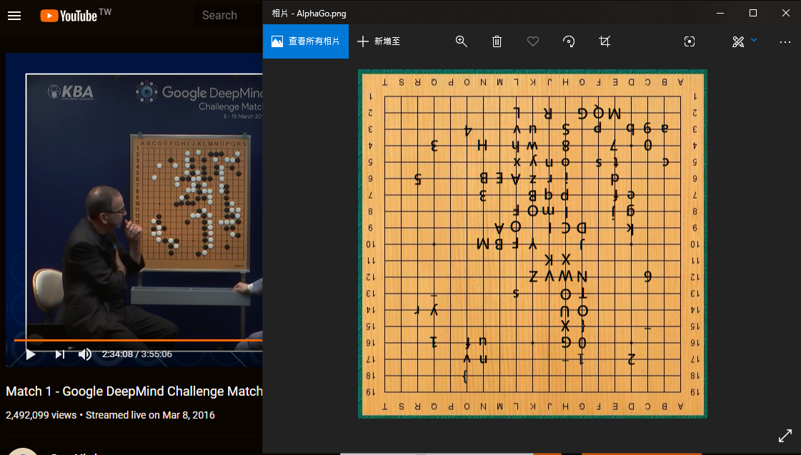

# BamBooFox: AlphaGo

**Category:** Misc

## Write-up
這題有給一個公開提示如下。  

```
hint: e01ddf6594a4387bbf520e7d678578151b8824849cc02783c66e9da6c07f953e
```

直接丟到 Google 得到 `1st`，然後題目又給了一個棋盤...。  

  

腦動大開就直接找 AlphaGo 的首場對弈，果不其然...  

  

怎麼看怎麼像啊! 於是就看著棋譜，一步一步的依照順序把對應的字元記錄下來得到以下字串。  

```
0123456789abcdefghijklmopqrstuvwxyzABCDEFGHIJKLMNOPQRSTUVWXYZBAMBOOFOX{G0_1s_v3ry_fun}
```

不得不說，這種類型的題目還滿有趣的，也很殺時間，一下子跨年就跨完了呢(?

**GetFlag:**

`BAMBOOFOX{G0_1s_v3ry_fun}`