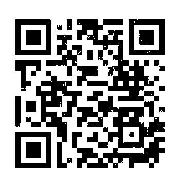
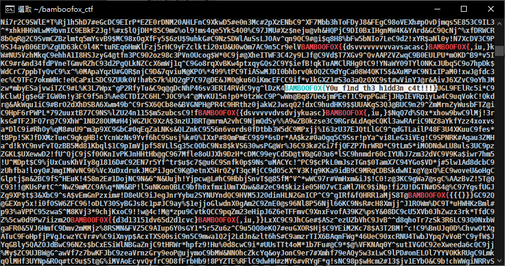

# BamBooFox: Find the Cat

**Category:** Misc

## Write-up
這題也是 CTF 老梗了，用 binwalk 就可發現裡面存了兩張圖片。  

```
DECIMAL       HEXADECIMAL     DESCRIPTION
--------------------------------------------------------------------------------
0             0x0             PNG image, 739 x 554, 8-bit/color RGBA, non-interlaced
101           0x65            Zlib compressed data, best compression
371382        0x5AAB6         PNG image, 739 x 554, 8-bit/color RGBA, non-interlaced
371483        0x5AB1B         Zlib compressed data, best compression
```

在 Linux 下，使用以下指令將兩張圖片分別存放。  

```bash
dd if=cat.png of=carter-1.jpg skip=371382 bs=1
dd if=cat.png of=carter-2.jpg count=371382 bs=1
```

接著看這兩張圖片，看似同一張圖，但檔案大小卻不相同，一定另有玄機，接著使用 `Stegsolve` 工具，將兩張圖片做 Image Combiner，就會看到一個 QR Code，至於怎麼處理比較好，我寫這份 Write-up 已經忘得差不多了，總之處理完得到以下的 QR Code。  

  

掃描後得到 imgur 的連結，是一張看起來不向圖片的圖片，使用 strings 檢視該圖檔，就發現 Flag 的蹤跡，但不只一個...，由於功力不足，還是透過 `grep` 加上肉眼人工找出 Flag。  

  

**GetFlag:**

`BAMBOOFOX{Y0u_f1nd_th3_h1dd3n_c4t!!!}`