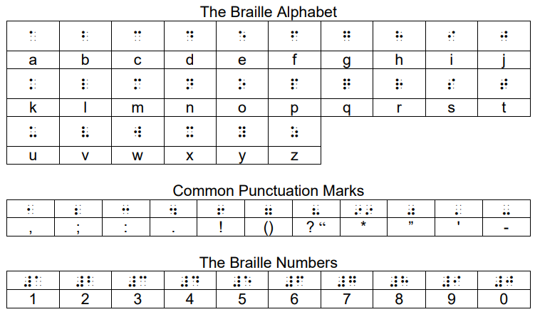
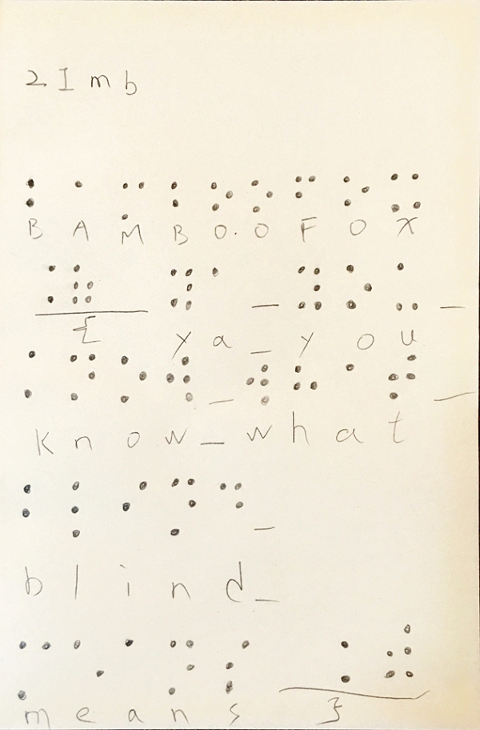

# BamBooFox: I can't see you!

**Category:** Misc

## Write-up
首先將下載下來的壓縮檔打開，需要輸入密碼，找了一下，發現網路上有 Online 的解密工具可以用，二話不說直接丟 [lostmypass](https://www.lostmypass.com/file-types/rar/)，接著得到密碼 `blind`。  

接著得到一張奇怪的密文表。  

  

接著直接丟 Google Images，找到這是 Braille Alphabet，於是嘗試使用 [dcode.fr](https://www.dcode.fr/braille-alphabet) 的解密服務解密，但由於他是用點的...，看到差點脫窗，於是改用以下對照表手解。  

  

解出來得到  

  

**GetFlag:**

`BAMBOOFOX{YA_YOU_KNOW_WHAT_BLIND_MEANS}`