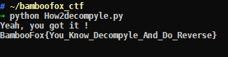

# BamBooFox: How2decompyle

**Category:** Reverse  

## Write-up
這題拿到之後，就發現他是編譯過的 Python 檔，透過線上服務做反編譯處理。  

[python-decompiler](https://python-decompiler.com/)  

然後還意外抓到這網站的 Bug，附檔名為大寫的 PYC 就不給丟了xDD，總之得到 Source Code 如下。

```python
import string
restrictions = ['uudcjkllpuqngqwbujnbhobowpx_kdkp_',
 'f_negcqevyxmauuhthijbwhpjbvalnhnm',
 'dsafqqwxaqtstghrfbxzp_x_xo_kzqxck',
 'mdmqs_tfxbwisprcjutkrsogarmijtcls',
 'kvpsbdddqcyuzrgdomvnmlaymnlbegnur',
 'oykgmfa_cmroybxsgwktlzfitgagwxawu',
 'ewxbxogihhmknjcpbymdxqljvsspnvzfv',
 'izjwevjzooutelioqrbggatwkqfcuzwin',
 'xtbifb_vzsilvyjmyqsxdkrrqwyyiu_vb',
 'watartiplxa_ktzn_ouwzndcrfutffyzd',
 'rqzhdgfhdnbpmomakleqfpmxetpwpobgj',
 'qggdzxprwisr_vkkipgftuvhsizlc_pbz',
 'jerzhlnsegcaqzathfpuufwunakdtceqw',
 'lbvlyyrugffgrwo_v_zrqvqszchqrrljq',
 'aiwuuhzbszvfpidwwkl_wynlujbsbhfox',
 'vmhrizxtiegxdxsqcdoiyxkffloudwtxg',
 'tffjnabob_jbf_qiszdsemczghnjysmah',
 'zrqkppvynlkelnevngwlkhgaputhoagtt',
 'nl_oojyafwoqccbedijmigpedkdzglq_f',
 'cksy_skctjlyxktuzchvstunyvcvabomc',
 'ppcxleeguvhvhengmvac_bykhzqohjuei',
 '_clmaicjrrzhwd_fescyaejtbyefxyihy',
 'hhopvwsmjtpjiffzatyhjrev_dwnsidyo',
 'sjevtrmkkk_zjalxrxfovjsbcxjx_pskp',
 'gnynwuuqypddbsylparpcczqimimqmvdl',
 'bxitcmhnmanwuhvjxnqeoiimlegrmkjra']
capital = [0, 4, 9, 19, 23, 26]
flag = raw_input('Please tell me something : ').lower()
flag = flag.lower()
if len(flag) != len(restrictions[0]):
    print 'No......You are wrong orzzzzz'
    exit(0)
for f in range(len(flag)):
    for r in restrictions:
        if flag[f] not in string.lowercase + '_' or flag[f] == r[f]:
            print 'No......You are wrong orzzzzzzzzzzzz'
            exit(0)

cap_flag = ''
for f in range(len(flag)):
    if f in capital:
        cap_flag += flag[f].upper()
    else:
        cap_flag += flag[f]

print 'Yeah, you got it !\nBambooFox{' + cap_flag + '}\n'
```

其實原理滿簡單的，就是 `restrictions` 陣列裡面共有 27 層，其中包含 26 個英文字母與 _ 且不重複，所以只要知道消失的字母是什麼，並且把每一個位置的字母找出來組合，就可以得到 Flag，但其中 `capital` 陣列代表的位置，表示的是大寫字母。  

解法也相當簡單，把以下程式碼進行修改。  

```python
flag = raw_input('Please tell me something : ').lower()
flag = flag.lower()
if len(flag) != len(restrictions[0]):
    print 'No......You are wrong orzzzzz'
    exit(0)
for f in range(len(flag)):
    for r in restrictions:
        if flag[f] not in string.lowercase + '_' or flag[f] == r[f]:
            print 'No......You are wrong orzzzzzzzzzzzz'
            exit(0)
```

修改成  

```python
key = ""
flag = ""
for f in range(33):
    for r in restrictions:
        key = "{}{}".format(key, r[f])
    for s in (string.lowercase + '_'):
        if s not in key:
            flag = "{}{}".format(flag, s)
            key = ""
            break
```

執行得到 Flag  



**GetFlag:**

`BambooFox{You_Know_Decompyle_And_Do_Reverse}`