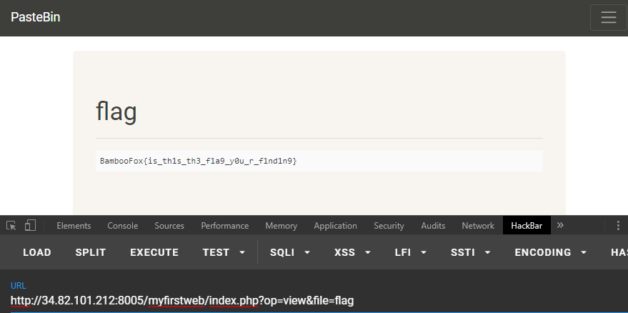

# BamBooFox: Web Newbie

**Category:** WEB  

## Write-up
這題花了不少時間，隨著時間越過越久，解題人數不斷提升，而我還在對著一個假的 Flag 懷疑人生。  

自以為聰明地以為是 LFI 的改起 url 上的 file 參數，讀取系統檔案、網頁上的 Source 都沒有問題，唯
有找到的 Flag 送出後一直吃紅。  

```
http://34.82.101.212:8005/myfirstweb/index.php?op=view&file=flag
```

最後才覺得怪怪的，才發現這根本是有人惡意丟上去的 Fake Flag!!!!  

  

花了半天時間才在開發者環境下看到有一段被註解的 HTML。  

```
      <!--
      <li class="nav-item">
        <a class="nav-link" href="/myfirstweb/index.php?op=nav&link=hint">Hint</a>
      </li>
      -->
```

瀏覽畫面如下。  

```
HINT
Flag is in ../flag.txt
```

直接告訴你 Flag 的位置了，當然經驗老到了我還是用 LFI 的方式讀取這該死的 flag.txt，得到了以下狀態。  

```
Found flag format in content, no flag for you!
```

結果卡了一陣子，我操!! 直接讀取不就好了嘛!!?  

```
http://34.82.101.212:8005/flag.txt
```

有時候想法變得複雜，簡單的思路越容易遺忘...  

**GetFlag:**

`BAMBOOFOX{0hhh_n0_s7up1d_li77l3_8ug}`